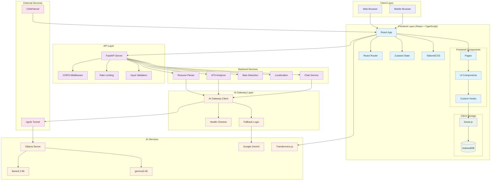
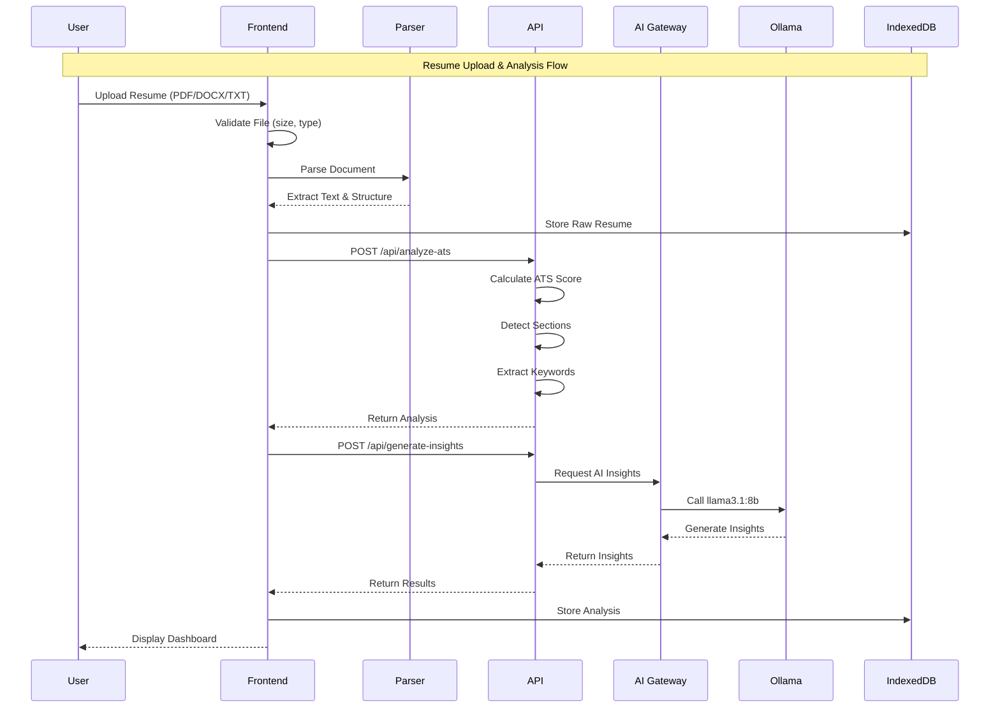
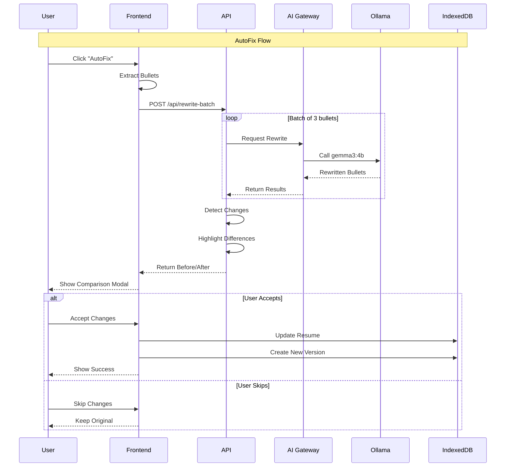
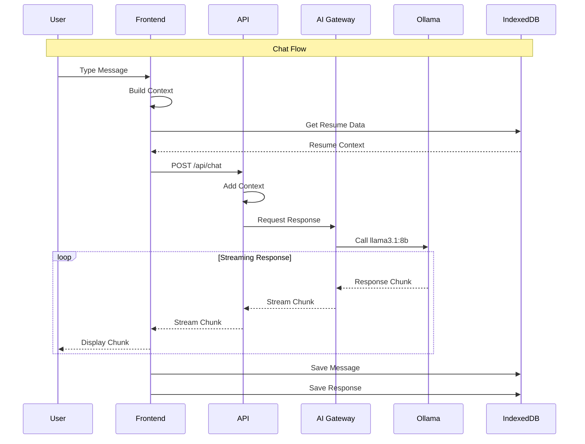
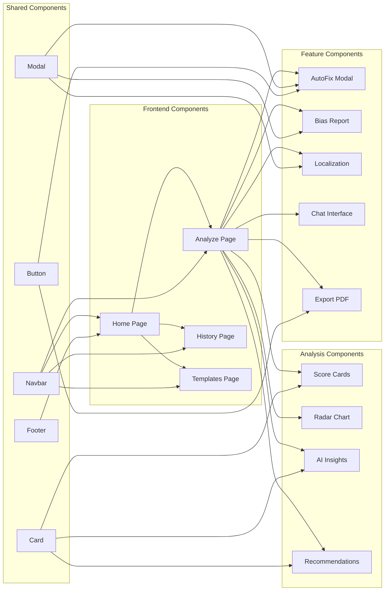
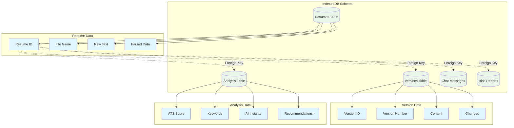
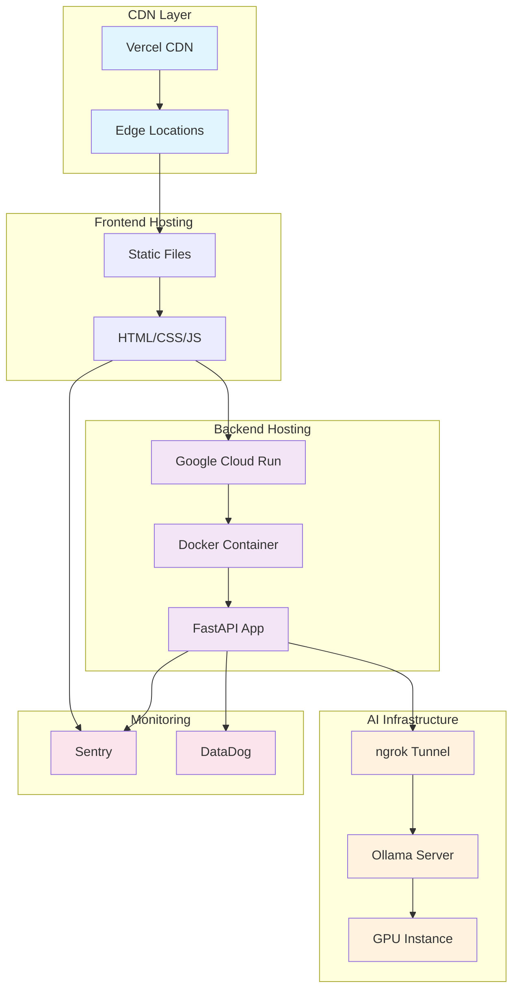
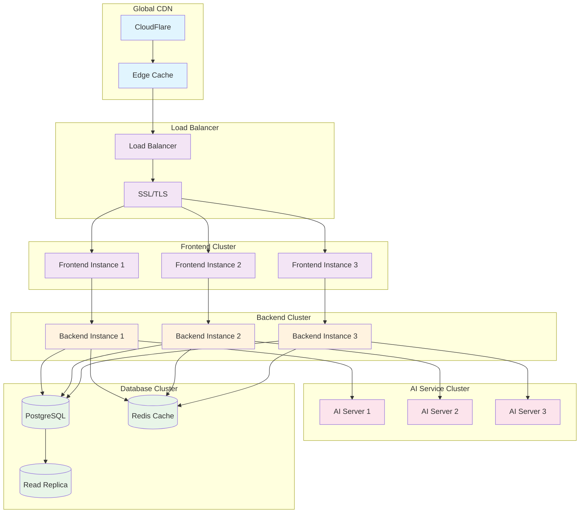
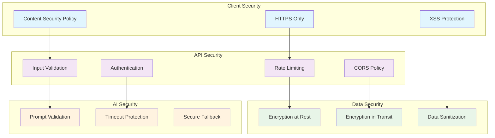

# System Architecture

## 🏗️ High-Level Architecture

---

## 🔄 Data Flow Architecture

### Resume Upload & Analysis Flow

### AutoFix Bullet Rewriting Flow

### AI Chat Assistant Flow

---

## 📦 Component Architecture

---

## 🗄️ Data Storage Architecture

---

## 🚀 Deployment Architecture

### MVP Deployment

### Full-Scale Deployment

---

## 🔐 Security Architecture

---

## 📊 Technology Stack

```mermaid
graph TB
    subgraph "Frontend Stack"
        REACT[React 18.2]
        TS[TypeScript 5.2]
        VITE[Vite 5.0]
        TAILWIND[TailwindCSS 3.3]
        ZUSTAND[Zustand 4.4]
        ROUTER[React Router 6.20]
        DEXIE[Dexie.js 3.2]
        RECHARTS[Recharts 2.10]
    end
    
    subgraph "Backend Stack"
        FASTAPI[FastAPI 0.115]
        PYTHON[Python 3.9+]
        PYDANTIC[Pydantic 2.10]
        UVICORN[Uvicorn 0.32]
    end
    
    subgraph "AI Stack"
        OLLAMA[Ollama]
        LLAMA_MODEL[llama3.1:8b]
        GEMMA_MODEL[gemma3:4b]
        TRANSFORMERS[Transformers.js 2.6]
        SENTENCE[sentence-transformers]
    end
    
    subgraph "Document Processing"
        PDFJS[pdfjs-dist 3.11]
        MAMMOTH[mammoth 1.6]
        PYMUPDF[PyMuPDF 1.24]
        DOCX[python-docx 1.1]
    end
    
    subgraph "Development Tools"
        ESLINT[ESLint 8.55]
        PRETTIER[Prettier]
        BLACK[Black]
        PYTEST[Pytest 7.4]
        VITEST[Vitest 1.0]
    end
    
    %% Connections
    REACT --> TS
    REACT --> VITE
    REACT --> TAILWIND
    REACT --> ZUSTAND
    REACT --> ROUTER
    REACT --> DEXIE
    REACT --> RECHARTS
    
    FASTAPI --> PYTHON
    FASTAPI --> PYDANTIC
    FASTAPI --> UVICORN
    
    OLLAMA --> LLAMA_MODEL
    OLLAMA --> GEMMA_MODEL
    REACT --> TRANSFORMERS
    FASTAPI --> SENTENCE
    
    REACT --> PDFJS
    REACT --> MAMMOTH
    FASTAPI --> PYMUPDF
    FASTAPI --> DOCX
    
    TS --> ESLINT
    TS --> PRETTIER
    PYTHON --> BLACK
    PYTHON --> PYTEST
    TS --> VITEST
    
    %% Styling
    classDef frontend fill:#e1f5fe
    classDef backend fill:#f3e5f5
    classDef ai fill:#fff3e0
    classDef docs fill:#e8f5e8
    classDef dev fill:#fce4ec
    
    class REACT,TS,VITE,TAILWIND,ZUSTAND,ROUTER,DEXIE,RECHARTS frontend
    class FASTAPI,PYTHON,PYDANTIC,UVICORN backend
    class OLLAMA,LLAMA_MODEL,GEMMA_MODEL,TRANSFORMERS,SENTENCE ai
    class PDFJS,MAMMOTH,PYMUPDF,DOCX docs
    class ESLINT,PRETTIER,BLACK,PYTEST,VITEST dev
```

---

## 📈 Scalability Considerations

### Horizontal Scaling
- Frontend: Static files on CDN
- Backend: Multiple API instances
- AI: Dedicated model servers
- Database: Read replicas

### Vertical Scaling
- AI servers: GPU instances
- Database: Larger instances
- Cache: More memory

### Caching Strategy
- Frontend: CDN caching
- API: Redis for responses
- AI: Model result caching
- Database: Query caching

---

## 🔧 Technology Decisions

### Why React?
- Large ecosystem
- Component reusability
- Strong TypeScript support
- Excellent developer experience

### Why FastAPI?
- High performance
- Automatic API docs
- Type safety with Pydantic
- Async support

### Why IndexedDB?
- Client-side storage
- No server costs
- Offline capability
- Large storage capacity

### Why Ollama?
- Local AI processing
- Privacy-first
- Cost-effective
- Multiple model support

---

## 📈 Performance Targets

### Frontend
- First Contentful Paint: < 1.5s
- Time to Interactive: < 3s
- Lighthouse Score: > 90

### Backend
- API Response Time: < 500ms
- AI Response Time: < 10s
- Uptime: > 99.9%

### AI
- Insights Generation: < 15s
- Bullet Rewriting: < 30s (batch of 3)
- Chat Response: < 5s

---

**Next**: [Architecture Layers](./05-architecture-layers.md)
