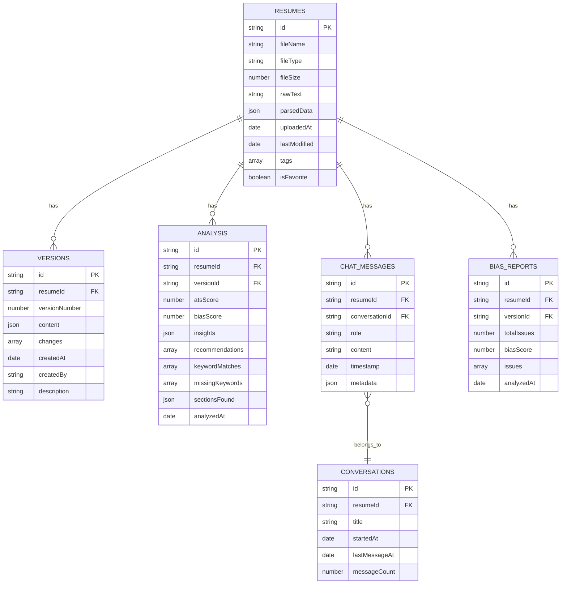
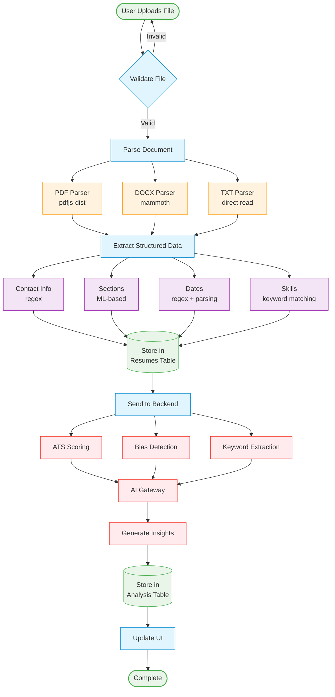

# Data Models & AI Architecture

## 📊 Database Schema (IndexedDB)

### Entity Relationship Diagram



### Resumes Table

```typescript
interface Resume {
  id: string                    // UUID
  fileName: string              // Original file name
  fileType: 'pdf' | 'docx' | 'txt'
  fileSize: number              // In bytes
  rawText: string               // Extracted text
  parsedData: ParsedResume      // Structured data
  uploadedAt: Date
  lastModified: Date
  tags: string[]                // User-defined tags
  isFavorite: boolean
}

interface ParsedResume {
  contact: ContactInfo
  summary: string | null
  experience: Experience[]
  education: Education[]
  skills: Skill[]
  certifications: Certification[]
  projects: Project[]
  sections: Section[]           // Custom sections
}

interface ContactInfo {
  name: string
  email: string | null
  phone: string | null
  location: string | null
  linkedin: string | null
  github: string | null
  website: string | null
}

interface Experience {
  id: string
  company: string
  position: string
  location: string | null
  startDate: string
  endDate: string | null        // null = current
  bullets: string[]
  technologies: string[]
}

interface Education {
  id: string
  institution: string
  degree: string
  field: string
  location: string | null
  graduationDate: string | null
  gpa: number | null
}

interface Skill {
  id: string
  name: string
  category: 'technical' | 'soft' | 'language' | 'other'
  proficiency: 'beginner' | 'intermediate' | 'advanced' | 'expert'
}

interface Certification {
  id: string
  name: string
  issuer: string
  date: string
  expiryDate: string | null
  credentialId: string | null
}

interface Project {
  id: string
  name: string
  description: string
  technologies: string[]
  url: string | null
  startDate: string | null
  endDate: string | null
}

interface Section {
  id: string
  title: string
  content: string
  order: number
}
```

### Versions Table

```typescript
interface Version {
  id: string                    // UUID
  resumeId: string              // Foreign key to Resume
  versionNumber: number         // 1, 2, 3, ...
  content: ParsedResume         // Full resume content
  changes: Change[]             // What changed
  createdAt: Date
  createdBy: VersionSource
  description: string | null    // User-provided description
}

type VersionSource = 
  | 'user'                      // Manual edit
  | 'autofix'                   // AutoFix applied
  | 'bias_fix'                  // Bias fixes applied
  | 'manual_edit'               // Direct text edit
  | 'template_change'           // Template changed
  | 'restore'                   // Restored from history

interface Change {
  type: 'add' | 'remove' | 'modify'
  section: string               // e.g., 'experience', 'skills'
  field: string | null          // e.g., 'bullets[0]'
  oldValue: any | null
  newValue: any | null
  reason: string | null         // Why the change was made
}
```

### Analysis Table

```typescript
interface Analysis {
  id: string                    // UUID
  resumeId: string              // Foreign key to Resume
  versionId: string             // Foreign key to Version
  atsScore: number              // 0-100
  biasScore: number             // 0-100 (lower is better)
  insights: AIInsights
  recommendations: Recommendation[]
  keywordMatches: KeywordMatch[]
  missingKeywords: string[]
  sectionsFound: SectionCheck
  analyzedAt: Date
  jobDescription: string | null // If matched to job
}

interface AIInsights {
  strengths: string[]
  gaps: string[]
  recommendations: string[]
  overallAssessment: string
  confidenceScore: number       // 0-1
  generatedAt: Date
  model: string                 // e.g., 'llama3.1:8b'
}

interface Recommendation {
  id: string
  type: 'add' | 'remove' | 'modify' | 'reorder'
  priority: 'high' | 'medium' | 'low'
  category: string              // e.g., 'keywords', 'formatting'
  title: string
  description: string
  impact: number                // Expected ATS score improvement
  applied: boolean
}

interface KeywordMatch {
  keyword: string
  found: boolean
  frequency: number
  importance: 'high' | 'medium' | 'low'
  context: string[]             // Where it appears
}

interface SectionCheck {
  contact: boolean
  summary: boolean
  experience: boolean
  education: boolean
  skills: boolean
  certifications: boolean
  projects: boolean
}
```

### Chat History Table

```typescript
interface ChatMessage {
  id: string                    // UUID
  resumeId: string              // Foreign key to Resume
  conversationId: string        // Group messages
  role: 'user' | 'assistant' | 'system'
  content: string
  timestamp: Date
  metadata: ChatMetadata | null
}

interface ChatMetadata {
  model: string                 // AI model used
  tokens: number                // Tokens consumed
  responseTime: number          // Milliseconds
  context: string[]             // What context was used
  suggestions: string[]         // Action suggestions
}

interface Conversation {
  id: string                    // UUID
  resumeId: string
  title: string                 // Auto-generated or user-set
  startedAt: Date
  lastMessageAt: Date
  messageCount: number
}
```

### Bias Reports Table

```typescript
interface BiasReport {
  id: string                    // UUID
  resumeId: string
  versionId: string
  totalIssues: number
  biasScore: number             // 0-100
  issues: BiasIssue[]
  analyzedAt: Date
}

interface BiasIssue {
  id: string
  original: string              // Biased phrase
  suggestion: string            // Neutral alternative
  reason: string                // Why it's biased
  category: BiasCategory
  severity: 'high' | 'medium' | 'low'
  position: {
    start: number
    end: number
  }
  context: string               // Surrounding text
  applied: boolean              // Was fix applied?
}

type BiasCategory = 
  | 'age'
  | 'gender'
  | 'race'
  | 'disability'
  | 'religion'
  | 'nationality'
  | 'other'
```

### Templates Table

```typescript
interface Template {
  id: string                    // UUID
  name: string
  description: string
  category: string              // e.g., 'modern', 'classic'
  industry: string[]            // Target industries
  experienceLevel: 'entry' | 'mid' | 'senior' | 'executive'
  atsScore: number              // Template's ATS compatibility
  thumbnail: string             // Base64 or URL
  layout: TemplateLayout
  styles: TemplateStyles
  isDefault: boolean
  isPremium: boolean
  createdAt: Date
  usageCount: number
}

interface TemplateLayout {
  columns: 1 | 2
  sections: TemplateSectionConfig[]
  margins: {
    top: number
    right: number
    bottom: number
    left: number
  }
  spacing: {
    section: number
    paragraph: number
    line: number
  }
}

interface TemplateSectionConfig {
  type: string                  // e.g., 'contact', 'experience'
  order: number
  visible: boolean
  style: string                 // CSS class or style object
}

interface TemplateStyles {
  fontFamily: string
  fontSize: {
    heading1: number
    heading2: number
    heading3: number
    body: number
  }
  colors: {
    primary: string
    secondary: string
    text: string
    accent: string
  }
  spacing: {
    section: number
    item: number
  }
}
```

---

## 🤖 AI Models Used

### 1. Ollama Models (Primary)

#### llama3.1:8b
- **Purpose**: AI Insights Generation
- **Use Cases**:
  - Analyzing resume strengths
  - Identifying skill gaps
  - Generating personalized recommendations
  - Overall resume assessment
- **Performance**:
  - Response time: 10-15 seconds
  - Context window: 8K tokens
  - Quality: High
- **Prompts**:
```python
INSIGHTS_PROMPT = """
Analyze this resume and provide:
1. Top 3 strengths
2. Top 3 gaps or areas for improvement
3. 5 specific, actionable recommendations
4. Overall assessment

Resume:
{resume_text}

Job Description (if provided):
{job_description}

Format as JSON with keys: strengths, gaps, recommendations, overall_assessment
"""
```

#### gemma3:4b
- **Purpose**: Bullet Point Rewriting
- **Use Cases**:
  - Improving resume bullets
  - Adding metrics and impact
  - Strengthening action verbs
  - Making achievements more concrete
- **Performance**:
  - Response time: 8-12 seconds per batch
  - Context window: 4K tokens
  - Quality: Good
  - Speed: Faster than llama3.1
- **Prompts**:
```python
REWRITE_PROMPT = """
Rewrite these resume bullets to be more impactful:

Original bullets:
{bullets}

Job description context:
{job_description}

Requirements:
- Use strong action verbs
- Add specific metrics where possible
- Emphasize achievements and impact
- Keep professional tone
- Maintain truthfulness

Return JSON array with: original, improved, changes
"""
```

### 2. Transformers.js (Client-Side)

#### all-MiniLM-L6-v2
- **Purpose**: Text Embeddings
- **Use Cases**:
  - Semantic similarity matching
  - Keyword relevance scoring
  - Job description matching
  - Skill clustering
- **Performance**:
  - Runs in browser
  - No server required
  - Fast (< 1 second)
- **Implementation**:
```typescript
import { pipeline } from '@xenova/transformers'

const embedder = await pipeline(
  'feature-extraction',
  'Xenova/all-MiniLM-L6-v2'
)

const embedding = await embedder(text, {
  pooling: 'mean',
  normalize: true
})
```

### 3. Google Gemini (Fallback)

#### gemini-1.5-flash
- **Purpose**: Fallback AI Service
- **Use Cases**:
  - When Ollama is unavailable
  - Cloud deployment without local AI
  - Backup for critical features
- **Performance**:
  - Response time: 3-8 seconds
  - Context window: 32K tokens
  - Quality: Excellent
- **Configuration**:
```python
import google.generativeai as genai

genai.configure(api_key=os.getenv('GOOGLE_API_KEY'))
model = genai.GenerativeModel('gemini-1.5-flash')
```

---

## 🔄 Data Flow Patterns

### Resume Upload Flow



### AutoFix Flow

```
User clicks AutoFix
    ↓
Frontend extracts bullets
    ↓
Send to backend (/api/rewrite-batch)
    ↓
Backend calls AI Gateway (gemma3:4b)
    ├─ Batch size: 3 bullets
    ├─ Timeout: 30 seconds
    └─ Retry: 2 attempts
    ↓
AI rewrites bullets
    ↓
Backend detects changes
    ├─ Diff algorithm
    ├─ Highlight changes
    └─ Categorize improvements
    ↓
Return to frontend
    ↓
User reviews changes
    ├─ Accept: Update resume
    └─ Skip: Keep original
    ↓
Create new version
    ├─ Store in Versions table
    ├─ Link to Resume
    └─ Record changes
    ↓
Re-analyze resume
    ↓
Update Analysis table
```

### Chat Flow

```
User sends message
    ↓
Frontend adds to ChatHistory
    ↓
Build context:
    ├─ Resume text
    ├─ Recent analysis
    ├─ Previous messages
    └─ User intent
    ↓
Send to backend (/api/chat)
    ↓
Backend calls AI Gateway (llama3.1:8b)
    ├─ Include context
    ├─ Stream response
    └─ Timeout: 30 seconds
    ↓
AI generates response
    ↓
Stream back to frontend
    ├─ Chunk by chunk
    └─ Update UI in real-time
    ↓
Store in ChatHistory
    ├─ User message
    ├─ Assistant response
    └─ Metadata
```

---

## 📈 Data Retention & Cleanup

### Automatic Cleanup

```typescript
// Clean up old data periodically
async function cleanupOldData() {
  const db = await getDB()
  
  // Delete resumes older than 90 days (if not favorited)
  await db.resumes
    .where('lastModified')
    .below(Date.now() - 90 * 24 * 60 * 60 * 1000)
    .and(resume => !resume.isFavorite)
    .delete()
  
  // Delete old versions (keep last 10 per resume)
  const resumes = await db.resumes.toArray()
  for (const resume of resumes) {
    const versions = await db.versions
      .where('resumeId')
      .equals(resume.id)
      .reverse()
      .sortBy('versionNumber')
    
    if (versions.length > 10) {
      const toDelete = versions.slice(10)
      await db.versions.bulkDelete(toDelete.map(v => v.id))
    }
  }
  
  // Delete old chat messages (keep last 100 per resume)
  for (const resume of resumes) {
    const messages = await db.chatMessages
      .where('resumeId')
      .equals(resume.id)
      .reverse()
      .sortBy('timestamp')
    
    if (messages.length > 100) {
      const toDelete = messages.slice(100)
      await db.chatMessages.bulkDelete(toDelete.map(m => m.id))
    }
  }
}
```

### Export Data

```typescript
// Export all user data
async function exportUserData() {
  const db = await getDB()
  
  const data = {
    resumes: await db.resumes.toArray(),
    versions: await db.versions.toArray(),
    analysis: await db.analysis.toArray(),
    chatHistory: await db.chatMessages.toArray(),
    biasReports: await db.biasReports.toArray(),
    exportedAt: new Date().toISOString()
  }
  
  const blob = new Blob([JSON.stringify(data, null, 2)], {
    type: 'application/json'
  })
  
  const url = URL.createObjectURL(blob)
  const a = document.createElement('a')
  a.href = url
  a.download = `career-plus-data-${Date.now()}.json`
  a.click()
}
```

---

## 🔐 Data Privacy

### Client-Side Processing
- Resume parsing happens in browser
- No resume text sent to servers (except for AI analysis)
- IndexedDB data never leaves device
- No tracking or analytics on resume content

### Server-Side Processing
- AI analysis only (temporary)
- No data persistence on servers
- Requests are stateless
- No user identification

### Future: Cloud Sync (Optional)
- End-to-end encryption
- User controls data sharing
- Opt-in only
- Can delete anytime

---

**Next**: [API Reference](./08-api-reference.md)
