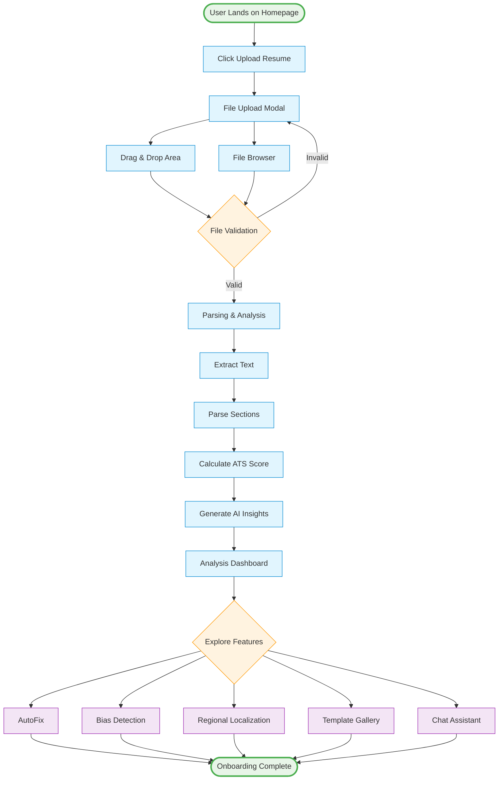
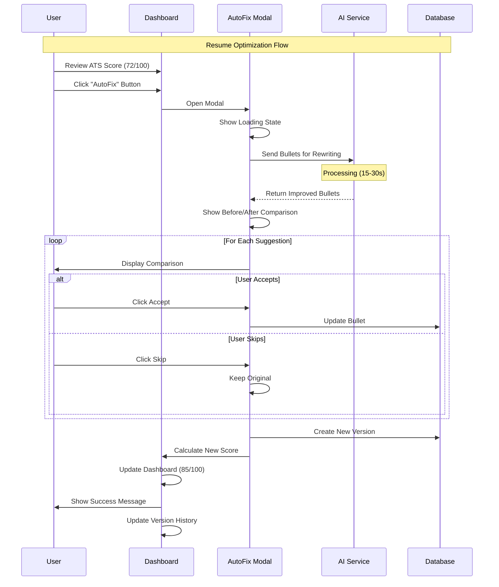
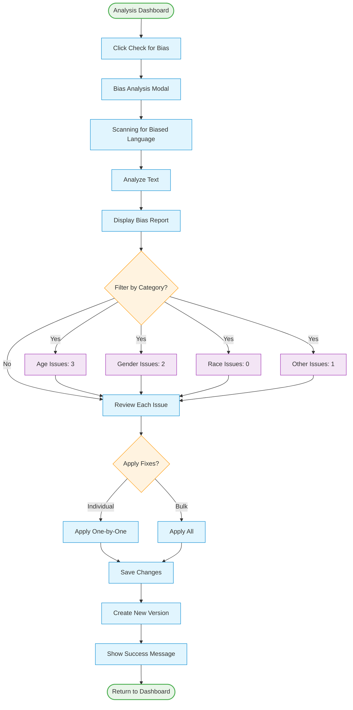
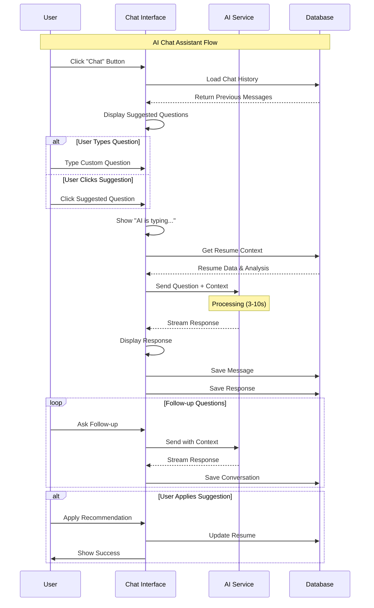

# User Flows

Detailed user journey mappings for Career+ platform.

## 🎯 Primary User Flows

### 1. First-Time User Onboarding



**Success Criteria:**
- User uploads resume successfully
- Analysis completes within 10 seconds
- User understands their ATS score
- User takes at least one action (AutoFix, Bias Check, etc.)

---

### 2. Resume Optimization Flow



**Success Criteria:**
- User accepts at least 50% of suggestions
- ATS score improves by 10+ points
- User understands what changed and why
- New version saved automatically

---

### 3. Bias Detection & Removal Flow



**Success Criteria:**
- User identifies all bias issues
- User fixes at least 80% of issues
- Bias score improves significantly
- User understands why changes were needed

---

### 4. Regional Localization Flow

```
Analysis Dashboard
    ↓
User sees "Optimize for Region" section
    ├─ 🇺🇸 US
    ├─ 🇬🇧 UK
    ├─ 🇪🇺 EU
    └─ 🌏 APAC
    ↓
User clicks region button (e.g., US)
    ↓
Localization Modal Opens
    ├─ Shows loading state
    └─ "Analyzing for US market..."
    ↓
Analysis completes (1-2 seconds)
    ↓
Localization Advice Displayed
    ├─ Tab 1: Recommendations
    │   ├─ Use "Resume" not "CV"
    │   ├─ Remove photo
    │   └─ Add phone with +1
    ├─ Tab 2: Format Changes
    │   ├─ Date format: MM/DD/YYYY
    │   ├─ Section order
    │   └─ Length guidelines
    ├─ Tab 3: Terminology
    │   ├─ CV → Resume
    │   ├─ Mobile → Cell phone
    │   └─ Postcode → ZIP code
    └─ Tab 4: Cultural Notes
        ├─ Emphasize achievements
        ├─ Use action verbs
        └─ Keep to 1-2 pages
    ↓
User reviews advice
    ↓
User clicks "Got it"
    ↓
Modal closes
    ↓
User applies changes manually
    (or uses AutoFix with region context)
```

**Success Criteria:**
- User understands regional differences
- User applies at least 3 recommendations
- Resume adapted for target region
- User feels confident about regional fit

---

### 5. Template Selection & Export Flow

```
Analysis Dashboard
    ↓
User clicks "Choose Template" button
    ↓
Template Gallery Opens
    ├─ Grid of templates
    ├─ Each shows:
    │   ├─ Preview thumbnail
    │   ├─ Template name
    │   ├─ ATS score
    │   └─ [Preview] button
    └─ Filters:
        ├─ Industry
        ├─ Experience level
        └─ ATS score
    ↓
User clicks [Preview] on template
    ↓
Template Preview Modal
    ├─ Full-size preview
    ├─ User's data populated
    ├─ [Use This Template] button
    └─ [Compare] button
    ↓
User clicks [Use This Template]
    ↓
Confirmation
    ├─ "Template applied"
    └─ "Ready to export"
    ↓
User clicks "Export PDF"
    ↓
Export Options Modal
    ├─ File name
    ├─ Template selection
    ├─ Include/exclude sections
    └─ [Download PDF] button
    ↓
PDF generation (2-5 seconds)
    ↓
Download starts
    ↓
Success message
    ├─ "Resume exported successfully"
    └─ "Saved to Downloads folder"
```

**Success Criteria:**
- User previews at least 2 templates
- User selects appropriate template
- PDF exports successfully
- PDF is ATS-compatible

---

### 6. Version History & Restore Flow

```
Analysis Dashboard
    ↓
User clicks "Version History" button
    ↓
Version History Panel Opens
    ├─ Timeline view
    ├─ Each version shows:
    │   ├─ Version number
    │   ├─ Timestamp
    │   ├─ Changes made
    │   ├─ ATS score
    │   └─ [Restore] [Export] buttons
    └─ Current version highlighted
    ↓
User clicks [Restore] on old version
    ↓
Confirmation Modal
    ├─ "Restore version X?"
    ├─ "Current changes will be saved as new version"
    └─ [Confirm] [Cancel]
    ↓
User confirms
    ↓
Version restored
    ├─ Current version saved
    ├─ Old version becomes current
    └─ Analysis re-run
    ↓
Success message
    ├─ "Version X restored"
    └─ "New version created from current state"
    ↓
Return to Analysis Dashboard
    ├─ Restored content displayed
    └─ Version history updated
```

**Success Criteria:**
- User can view all versions
- User successfully restores old version
- Current work is not lost
- User understands version system

---

### 7. AI Chat Assistant Flow



**Success Criteria:**
- User gets relevant answers
- AI provides actionable advice
- User asks at least 2 questions
- User applies at least 1 suggestion

---

## 🔄 Secondary User Flows

### 8. Returning User Flow

```
Landing Page
    ↓
User sees "Recent Resumes" section
    ├─ Last 5 resumes
    ├─ Each shows:
    │   ├─ File name
    │   ├─ Last modified
    │   ├─ ATS score
    │   └─ [Open] button
    └─ [Upload New] button
    ↓
User clicks [Open] on resume
    ↓
Analysis Dashboard loads
    ├─ Previous analysis displayed
    ├─ Version history available
    └─ Can continue editing
```

### 9. Job Description Matching Flow

```
Analysis Dashboard
    ↓
User clicks "Match to Job" button
    ↓
Job Description Modal
    ├─ Paste job description
    └─ [Analyze Match] button
    ↓
Matching analysis (5-10 seconds)
    ↓
Match Report
    ├─ Match score: X%
    ├─ Matched keywords
    ├─ Missing keywords
    ├─ Suggested additions
    └─ [Optimize for This Job] button
    ↓
User clicks [Optimize]
    ↓
AutoFix runs with job context
    ↓
Resume optimized for specific job
```

### 10. Comparison Flow

```
Version History
    ↓
User selects 2 versions
    ↓
Clicks [Compare] button
    ↓
Comparison View
    ├─ Side-by-side display
    ├─ Differences highlighted
    ├─ Score comparison
    └─ Change summary
    ↓
User can:
    ├─ Restore either version
    ├─ Export either version
    └─ Merge changes (future)
```

---

## 📊 User Flow Metrics

### Key Performance Indicators

| Flow | Success Rate Target | Avg. Time | Drop-off Points |
|------|-------------------|-----------|-----------------|
| Onboarding | 85% | 2 min | File upload, Analysis wait |
| AutoFix | 70% | 3 min | Review suggestions |
| Bias Detection | 80% | 2 min | Understanding issues |
| Localization | 90% | 1 min | None |
| Template Export | 95% | 1 min | PDF generation |
| Version Restore | 85% | 30 sec | Confirmation |
| Chat Assistant | 75% | 5 min | Getting relevant answers |

### Optimization Opportunities

1. **Reduce Analysis Time**: Target < 5 seconds
2. **Improve AutoFix Acceptance**: Add more context
3. **Simplify Bias Fixes**: One-click apply all
4. **Faster PDF Export**: Optimize generation
5. **Better Chat Suggestions**: More relevant prompts

---

## 🎨 User Experience Principles

### 1. Progressive Disclosure
- Show basic features first
- Reveal advanced features as needed
- Don't overwhelm new users

### 2. Immediate Feedback
- Show loading states
- Provide progress indicators
- Confirm all actions

### 3. Reversible Actions
- Allow undo/redo
- Save versions automatically
- Confirm destructive actions

### 4. Clear Navigation
- Always show current location
- Provide breadcrumbs
- Easy return to dashboard

### 5. Contextual Help
- Tooltips for complex features
- Inline documentation
- AI chat for questions

---

**Next**: [Onboarding Flow](./11-onboarding-flow.md)
