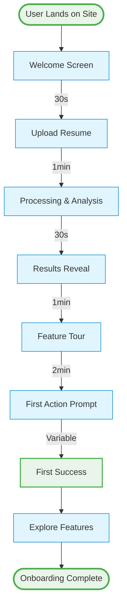

# Complete User Onboarding Flow

## 🎯 Onboarding Goals

1. **Get user to first value** within 5 minutes
2. **Demonstrate core features** without overwhelming
3. **Build confidence** in AI recommendations
4. **Encourage exploration** of additional features
5. **Drive conversion** to premium (future)

---

## 📋 Onboarding Journey

### Complete Onboarding Flow



### Step 1: Landing & Welcome (30 seconds)

```
┌─────────────────────────────────────────────────────────────────┐
│                                                                  │
│              Welcome to Career+ 👋                              │
│                                                                  │
│         Your AI-Powered Resume Optimization Platform            │
│                                                                  │
│  We'll help you:                                                │
│  ✓ Optimize your resume for ATS systems                        │
│  ✓ Remove biased language                                      │
│  ✓ Adapt for different regions                                 │
│  ✓ Get AI-powered insights                                     │
│                                                                  │
│              [Get Started - It's Free!]                         │
│                                                                  │
│  No credit card required • Takes 5 minutes                      │
│                                                                  │
└─────────────────────────────────────────────────────────────────┘
```

**Key Elements:**
- Clear value proposition
- Benefits list
- Low-friction CTA
- Trust signals (free, no CC)

---

### Step 2: Resume Upload (1 minute)

```
┌─────────────────────────────────────────────────────────────────┐
│  Step 1 of 4: Upload Your Resume                               │
│  ████████░░░░░░░░░░░░░░░░░░░░░░░░░░░░░░░░░░░░░░░░░░░░ 25%    │
├─────────────────────────────────────────────────────────────────┤
│                                                                  │
│  ┌────────────────────────────────────────────────────────┐   │
│  │                                                         │   │
│  │              📄 Drag & Drop Your Resume                │   │
│  │                                                         │   │
│  │                  or [Browse Files]                     │   │
│  │                                                         │   │
│  │     Supported: PDF, DOCX, TXT (Max 10MB)              │   │
│  │                                                         │   │
│  └────────────────────────────────────────────────────────┘   │
│                                                                  │
│  💡 Tip: Use your most recent resume for best results          │
│                                                                  │
│  Don't have a resume? [Start from scratch]                     │
│                                                                  │
└─────────────────────────────────────────────────────────────────┘
```

**Features:**
- Progress indicator
- Clear instructions
- Helpful tip
- Alternative path (start from scratch)

**Validation:**
- File size check
- Format validation
- Content verification

---

### Step 3: Processing & First Impressions (30 seconds)

```
┌─────────────────────────────────────────────────────────────────┐
│  Analyzing Your Resume...                                       │
├─────────────────────────────────────────────────────────────────┤
│                                                                  │
│              ⚙️ Processing your resume                         │
│                                                                  │
│  [████████████████████░░░░░░░░] 75%                            │
│                                                                  │
│  ✓ Extracted text from PDF                                     │
│  ✓ Identified resume sections                                  │
│  ✓ Calculating ATS score                                       │
│  ⏳ Generating AI insights...                                   │
│                                                                  │
│  Did you know?                                                  │
│  75% of resumes are rejected by ATS systems before a human     │
│  ever sees them. We'll help you beat the bots! 🤖              │
│                                                                  │
└─────────────────────────────────────────────────────────────────┘
```

**Features:**
- Real-time progress
- Step-by-step updates
- Educational content
- Reduces perceived wait time

---

### Step 4: Results Reveal (1 minute)

```
┌─────────────────────────────────────────────────────────────────┐
│  Your Resume Analysis is Ready! 🎉                             │
├─────────────────────────────────────────────────────────────────┤
│                                                                  │
│  ┌──────────────────────────────────────────────────────────┐  │
│  │                                                           │  │
│  │              Your ATS Score: 72/100                      │  │
│  │                                                           │  │
│  │              ⭐⭐⭐☆☆ Good                                │  │
│  │                                                           │  │
│  │  Your resume is performing well, but there's room for   │  │
│  │  improvement. Let's get you to 85+!                     │  │
│  │                                                           │  │
│  └──────────────────────────────────────────────────────────┘  │
│                                                                  │
│  Quick Wins:                                                    │
│  • 3 missing keywords from job descriptions                    │
│  • 2 potential bias issues detected                            │
│  • 5 bullets could be stronger                                 │
│                                                                  │
│              [See Full Analysis]                                │
│                                                                  │
└─────────────────────────────────────────────────────────────────┘
```

**Features:**
- Positive framing
- Clear score
- Quick wins list
- CTA to explore more

---

### Step 5: Feature Tour (2 minutes)

#### Tour Stop 1: AI Insights

```
┌─────────────────────────────────────────────────────────────────┐
│  💡 Feature Tour (1 of 4)                              [Skip]   │
├─────────────────────────────────────────────────────────────────┤
│                                                                  │
│  🤖 AI-Powered Insights                                         │
│                                                                  │
│  Our AI has analyzed your resume and identified:               │
│                                                                  │
│  Strengths:                                                     │
│  ✓ Strong technical background                                 │
│  ✓ Clear career progression                                    │
│                                                                  │
│  Areas to Improve:                                              │
│  • Add more quantifiable achievements                           │
│  • Highlight leadership experience                             │
│                                                                  │
│  💡 These insights are personalized to YOUR resume             │
│                                                                  │
│              [Next: AutoFix Feature]                            │
│                                                                  │
└─────────────────────────────────────────────────────────────────┘
```

#### Tour Stop 2: AutoFix

```
┌─────────────────────────────────────────────────────────────────┐
│  💡 Feature Tour (2 of 4)                              [Skip]   │
├─────────────────────────────────────────────────────────────────┤
│                                                                  │
│  🔧 AutoFix - AI Resume Enhancement                            │
│                                                                  │
│  Let AI rewrite your bullets for maximum impact:               │
│                                                                  │
│  Before:                                                         │
│  "Responsible for managing projects"                            │
│                                                                  │
│  After:                                                          │
│  "Led 12+ cross-functional projects, increasing team           │
│   productivity by 25%"                                          │
│                                                                  │
│  ✓ Stronger action verbs                                       │
│  ✓ Specific metrics added                                      │
│  ✓ Measurable outcomes                                         │
│                                                                  │
│              [Try AutoFix Now] [Next]                          │
│                                                                  │
└─────────────────────────────────────────────────────────────────┘
```

#### Tour Stop 3: Bias Detection

```
┌─────────────────────────────────────────────────────────────────┐
│  💡 Feature Tour (3 of 4)                              [Skip]   │
├─────────────────────────────────────────────────────────────────┤
│                                                                  │
│  🎯 Bias Detection                                              │
│                                                                  │
│  Remove unconscious bias from your resume:                      │
│                                                                  │
│  We detected 2 potential issues:                                │
│                                                                  │
│  ⚠️ "young and energetic" → "energetic"                        │
│     (Avoid age references)                                      │
│                                                                  │
│  ⚠️ "salesman" → "salesperson"                                 │
│     (Use gender-neutral terms)                                  │
│                                                                  │
│  💡 Bias-free resumes perform better and are more inclusive    │
│                                                                  │
│              [Check My Resume] [Next]                          │
│                                                                  │
└─────────────────────────────────────────────────────────────────┘
```

#### Tour Stop 4: Regional Localization

```
┌─────────────────────────────────────────────────────────────────┐
│  💡 Feature Tour (4 of 4)                              [Skip]   │
├─────────────────────────────────────────────────────────────────┤
│                                                                  │
│  🌍 Regional Localization                                       │
│                                                                  │
│  Adapt your resume for different markets:                       │
│                                                                  │
│  🇺🇸 US: Use "Resume", remove photo, MM/DD/YYYY dates         │
│  🇬🇧 UK: Use "CV", include photo optional, DD/MM/YYYY         │
│  🇪🇺 EU: Include photo, detailed format, DD.MM.YYYY           │
│  🌏 APAC: Varies by country, we'll guide you                   │
│                                                                  │
│  💡 Regional differences matter - get them right!              │
│                                                                  │
│              [Finish Tour]                                      │
│                                                                  │
└─────────────────────────────────────────────────────────────────┘
```

---

### Step 6: First Action Prompt (30 seconds)

```
┌─────────────────────────────────────────────────────────────────┐
│  Ready to Optimize Your Resume? 🚀                             │
├─────────────────────────────────────────────────────────────────┤
│                                                                  │
│  Based on your analysis, we recommend starting with:           │
│                                                                  │
│  ┌────────────────────────────────────────────────────────┐   │
│  │  🔧 AutoFix (Recommended)                              │   │
│  │                                                         │   │
│  │  Improve 5 weak bullets in your resume                │   │
│  │  Estimated time: 2 minutes                             │   │
│  │  Expected score increase: +8 points                    │   │
│  │                                                         │   │
│  │              [Start AutoFix]                           │   │
│  └────────────────────────────────────────────────────────┘   │
│                                                                  │
│  Or choose another action:                                      │
│  • [Check for Bias] - 1 minute                                 │
│  • [Optimize for Region] - 1 minute                            │
│  • [Chat with AI] - Ask questions                              │
│                                                                  │
│              [Explore Dashboard Instead]                        │
│                                                                  │
└─────────────────────────────────────────────────────────────────┘
```

**Features:**
- Personalized recommendation
- Clear time estimate
- Expected outcome
- Alternative actions
- Option to explore freely

---

### Step 7: First Success (Variable)

```
┌─────────────────────────────────────────────────────────────────┐
│  Congratulations! 🎉                                            │
├─────────────────────────────────────────────────────────────────┤
│                                                                  │
│  You've improved your resume!                                   │
│                                                                  │
│  ┌────────────────────────────────────────────────────────┐   │
│  │                                                         │   │
│  │  ATS Score: 72 → 80 (+8 points!)                      │   │
│  │                                                         │   │
│  │  ⭐⭐⭐⭐☆ Very Good                                    │   │
│  │                                                         │   │
│  └────────────────────────────────────────────────────────┘   │
│                                                                  │
│  Changes made:                                                  │
│  ✓ 5 bullets improved with AI                                  │
│  ✓ Added metrics and action verbs                              │
│  ✓ Increased impact and clarity                                │
│                                                                  │
│  Next steps:                                                    │
│  • [Check for Bias] to further improve                         │
│  • [Export PDF] to download your resume                        │
│  • [Chat with AI] for personalized advice                      │
│                                                                  │
│              [Continue Optimizing]                              │
│                                                                  │
└─────────────────────────────────────────────────────────────────┘
```

**Features:**
- Celebrate success
- Show improvement
- Suggest next steps
- Keep momentum going

---

## 📊 Onboarding Metrics

### Success Metrics

| Metric | Target | Measurement |
|--------|--------|-------------|
| Completion Rate | 80% | Users who finish onboarding |
| Time to First Value | < 5 min | Upload to first insight |
| Feature Adoption | 60% | Users who try 2+ features |
| Return Rate (D1) | 40% | Users who return next day |
| Return Rate (D7) | 25% | Users who return in week |

### Drop-off Points

1. **Upload Step**: 15% drop-off
   - Mitigation: Simplify upload, add examples
2. **Processing Wait**: 10% drop-off
   - Mitigation: Engaging content, progress updates
3. **Feature Tour**: 20% drop-off
   - Mitigation: Make skippable, shorter tour
4. **First Action**: 15% drop-off
   - Mitigation: Clear recommendation, easy start

---

## 🎯 Personalization

### Based on Resume Quality

**High Quality Resume (ATS 80+)**
- Congratulate on strong resume
- Focus on fine-tuning
- Suggest advanced features
- Highlight export options

**Medium Quality Resume (ATS 60-79)**
- Show improvement potential
- Recommend AutoFix first
- Emphasize quick wins
- Build confidence

**Low Quality Resume (ATS < 60)**
- Be encouraging, not discouraging
- Break improvements into steps
- Celebrate small wins
- Provide more guidance

### Based on User Type

**Career Switcher**
- Highlight transferable skills
- Focus on reframing experience
- Suggest industry-specific keywords
- Provide career transition tips

**Recent Graduate**
- Emphasize education and projects
- Help maximize limited experience
- Suggest skill highlighting
- Provide entry-level tips

**Experienced Professional**
- Focus on leadership and impact
- Suggest quantifying achievements
- Highlight career progression
- Provide senior-level tips

---

## 💡 Onboarding Best Practices

### 1. Progressive Disclosure
- Don't show everything at once
- Reveal features as needed
- Let users explore at their pace

### 2. Quick Wins
- Get users to success fast
- Celebrate small victories
- Build confidence early

### 3. Clear Value
- Show benefits, not features
- Use concrete examples
- Demonstrate real improvements

### 4. Low Friction
- Minimize required steps
- Make everything optional
- Allow skipping

### 5. Contextual Help
- Provide tips when needed
- Don't overwhelm with info
- Make help easily accessible

---

## 🔄 Re-engagement for Drop-offs

### Email Sequence

**Day 1: Didn't complete upload**
```
Subject: Finish optimizing your resume in 5 minutes

Hi [Name],

You started uploading your resume but didn't finish. 
We're here to help!

[Complete Your Upload]

Need help? Reply to this email.
```

**Day 3: Uploaded but didn't take action**
```
Subject: Your resume analysis is waiting

Hi [Name],

Your resume scored 72/100. We found 3 quick ways 
to improve it:

1. AutoFix 5 weak bullets (+8 points)
2. Remove 2 bias issues (+3 points)
3. Add missing keywords (+5 points)

[Improve Your Resume]
```

**Day 7: Took one action but didn't return**
```
Subject: You're 80% there! Finish optimizing your resume

Hi [Name],

Great job improving your resume to 80/100! 

You're so close to an excellent score. Here's what's left:

• Check for bias (1 minute)
• Optimize for your target region (1 minute)
• Export your polished resume

[Finish Optimization]
```

---

## 📱 Mobile Onboarding

### Simplified Mobile Flow

1. **Welcome Screen** (swipeable)
2. **Upload** (camera or file)
3. **Processing** (with tips)
4. **Results** (score + 1 quick win)
5. **One Action** (AutoFix recommended)
6. **Success** (celebrate + next step)

**Key Differences:**
- Shorter tour (2 stops instead of 4)
- Larger touch targets
- Simplified UI
- Focus on one action at a time

---

**Next**: [UI Wireframes](./12-ui-wireframes.md)
